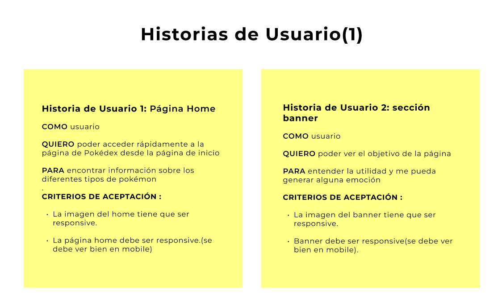

# Pokémon

## Índice

1. [Resumen](https://github.com/melanierolo/DEV008-data-lovers/tree/development#1-resumen#1-resumen)
2. [Definición de Producto](https://github.com/melanierolo/DEV008-data-lovers/tree/development#2-definición-de-producto)
3. [Historias de usuario](https://github.com/melanierolo/DEV008-data-lovers/tree/development#3-historias-de-usuario)
4. [Prototipos](https://github.com/melanierolo/DEV008-data-lovers/tree/development/#4-prototipos)
5. [Objetivos de aprendizaje](https://github.com/melanierolo/DEV008-data-lovers/tree/development#5-objetivos-de-aprendizaje)
6. [Checklist](https://github.com/melanierolo/DEV008-data-lovers/tree/development#6-checklist)

## 1. Resumen

El propósito de este proyecto fue desarrollar una página web responsive utilizando el marco de trabajo ágil SCRUM. Además, tuvo como objetivo principal facilitar al usuario el filtrado, ordenamiento y presentar de forma amigable la información detallada de cada Pokémon.

## 2. Definición de Producto

Realizamos un cuestionario para saber las preferencias de los usuarios para mejorar la búsqueda y visualización de la información de los Pokémon. A continuación se detallan los resultados obtenidos:

a. Nuestros usuarios están en el rango de edad de 25 a 34 años. Además, la mayoría que respondío la encuesta pertenece al género Masculino.

b. La razón principal de nuestros usarios para usar la aplicación es el entretenimientos, diversión y las batallas emocionantes de los Pokémon.
.

c.La información relevante para una interfaz, según los usuarios, fue la imagen y estadísticas de combate.Además, se considero importante las habilidades y debilidades.

.

d. Para los filtros el usuario consideró importante buscar por nombre, tipo de pokémon y nivel de rareza.

e. Por último, la mayoría de los usuarios le gustaría hacer uso de la web a cualquier hora del día.

## 3. Historias de usuario

[Link con todas las historias de usuario](https://drive.google.com/file/d/173blWjfZayMJQAWlxxrScin8C-b8UCzi/view?usp=sharing)

## 4. Prototipos

### Prototipo de baja fidelidad

En el prototipo de baja fidelidad usamos la herramienta moqups, con la que iteramos nuestros diseños de proyecto; incluimos una página de bienvenida, una página de banner y filtrado, y la página de cards general; todo esto en versión mobile y desktop.

Para ver más nuestro prototipo completo, click en el siguiente enlace:

[PDF - prototipo de baja fidelidad](https://drive.google.com/file/d/10MHKi5PGgVrv-IVHcoytWCiiMKZjo17R/view)

## Prototipo de alta fidelidad

En el prototipo de alta fidelidad usamos la herramienta figma, donde implementamos conceptos de atomic design para agrupar los elementos de nuestra página (tamaños de fuente, botones, pills, etc.); guardamos los colores de nuestro proyecto, y las imágenes a utilizar y comenzamos a prototipar con la idea que ya habíamos plasmado en moqups. También agregamos el diseño de la card individual de información del pokemon y el de la página de not found.

Para ver más nuestro prototipo de alta fidelidad, click en el siguiente enlace:

[Figma - prototipo de alta fidelidad](https://www.figma.com/proto/EFLWDgx993yeqVcVaelNCI/Pok%C3%A9monApp?type=design&node-id=465-690&scaling=min-zoom&page-id=2%3A2)

## 5. Objetivos de aprendizaje

### HTML

- [ ] **Uso de HTML semántico**

### CSS

- [ ] **Uso de selectores de CSS**

- [ ] **Modelo de caja (box model): borde, margen, padding**

- [ ] **Uso de flexbox en CSS**

### Web APIs

- [ ] **Uso de selectores del DOM**

- [ ] **Manejo de eventos del DOM (listeners, propagación, delegación)**

- [ ] **Manipulación dinámica del DOM**

### JavaScript

- [ ] **Diferenciar entre tipos de datos primitivos y no primitivos**

- [ ] **Arrays (arreglos)**

- [ ] **Objetos (key, value)**

- [ ] **Variables (declaración, asignación, ámbito)**

- [ ] **Uso de condicionales (if-else, switch, operador ternario, lógica booleana)**

- [ ] **Uso de bucles/ciclos (while, for, for..of)**

- [ ] **Funciones (params, args, return)**

- [ ] **Pruebas unitarias (unit tests)**

- [ ] **Módulos de ECMAScript (ES Modules)**

- [ ] **Uso de linter (ESLINT)**

- [ ] **Uso de identificadores descriptivos (Nomenclatura y Semántica)**

- [ ] **Diferenciar entre expresiones (expressions) y sentencias (statements)**

### Control de Versiones (Git y GitHub)

- [ ] **Git: Instalación y configuración**

- [ ] **Git: Control de versiones con git (init, clone, add, commit, status, push, pull, remote)**

- [ ] **Git: Integración de cambios entre ramas (branch, checkout, fetch, merge, reset, rebase, tag)**

- [ ] **GitHub: Creación de cuenta y repos, configuración de llaves SSH**

- [ ] **GitHub: Despliegue con GitHub Pages**

- [ ] **GitHub: Colaboración en Github (branches | forks | pull requests | code review | tags)**

### Centrado en el usuario

- [ ] **Diseñar y desarrollar un producto o servicio poniendo a las usuarias en el centro**

### Diseño de producto

- [ ] **Crear prototipos de alta fidelidad que incluyan interacciones**

- [ ] **Seguir los principios básicos de diseño visual**

### Investigación

- [ ] **Planear y ejecutar testeos de usabilidad de prototipos en distintos niveles de fidelidad**

## 6. Checklist

- [ ] Usa VanillaJS.
- [ ] Pasa linter (`npm run pretest`)
- [ ] Pasa tests (`npm test`)
- [ ] Pruebas unitarias cubren un mínimo del 70% de statements, functions y
      lines y branches.
- [ ] Incluye _Definición del producto_ clara e informativa en `README.md`.
- [ ] Incluye historias de usuario en `README.md`.
- [ ] Incluye _sketch_ de la solución (prototipo de baja fidelidad) en
      `README.md`.
- [ ] Incluye _Diseño de la Interfaz de Usuario_ (prototipo de alta fidelidad)
      en `README.md`.
- [ ] Incluye link a Zeplin en `README.md`.
- [ ] Incluye el listado de problemas que detectaste a través de tests de
      usabilidad en el `README.md`.
- [ ] UI: Muestra lista y/o tabla con datos y/o indicadores.
- [ ] UI: Permite ordenar data por uno o más campos (asc y desc).
- [ ] UI: Permite filtrar data en base a una condición.
- [ ] UI: Es _responsive_.
